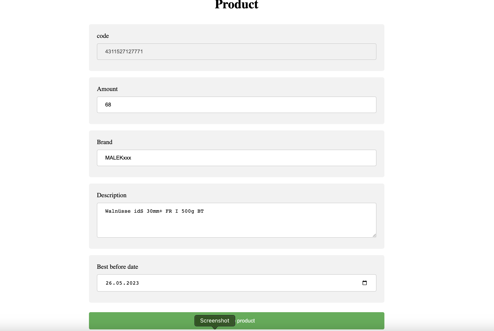

# SPRK Frontend Coding Challenge

#### All TODO comment couldn't be achieved because lack of time dedicated to the task

## Main technologies used

- NextJs
- Typescript
- React
- json-server
- React Native Testing Library
- @ericblade/quagga2

## Main functionality

- Home Page contain barcode Scanner.
- Product Page contains a form allowing the user to change data (except the GTIN)
- User can update the existent product.

### Run the app

- yarn install
- yarn dev
- json-server --watch db.json --port 3001 //to lanch the Mock json-server

# Docker solution // frontend well build but json-server creating problem

- COMPOSE_DOCKER_CLI_BUILD=1 DOCKER_BUILDKIT=1 docker-compose build
- docker-compose up

### Run tests

- yarn Test

## Screenshots

  
  

